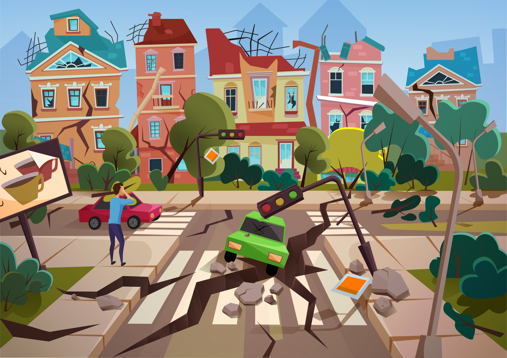

# Mapping_Earthquakes

*****
*****

* By: Tyler Sojka
* December 2020
* JavaScript: Using JavaScript to create a web dashboard with plotly, jQuery, HTML, D3.js
  
*****
*****

## Tools

* JavaScript
  * Often abbreviated as JS, is a programming language that conforms to the ECMAScript specification. JavaScript is high-level, often just-in-time compiled, and multi-paradigm. It has curly-bracket syntax, dynamic typing, prototype-based object-orientation, and first-class functions.
* D3.js
  * A JavaScript library for producing dynamic, interactive data visualizations in web browsers.
* HTML
  * Hypertext Markup Language is the standard markup language for documents designed to be displayed in a web browser. It can be assisted by technologies such as Cascading Style Sheets and scripting languages such as JavaScript.
* Mapbox
  * Mapbox is an American provider of custom online maps, SDKs and APIs for developers and designers to build real time location awareness into their own websites and applications.
* Leaflet
  * Leaflet is the leading open-source JavaScript library for mobile-friendly interactive maps. Weighing just about 39 KB of JS , it has all the mapping features most developers ever need. Leaflet is designed with simplicity, performance and usability in mind.
* CSS
  * Cascading Style Sheets is a style sheet language used for describing the presentation of a document written in a markup language such as HTML. CSS is a cornerstone technology of the World Wide Web, alongside HTML and JavaScript.
* Coolors
  * Web App to generate or browse beautiful color combinations for your designs.
* GeoJSON
  * GeoJSON is a format for encoding a variety of geographic data structures […]. A GeoJSON object may represent a region of space (a Geometry), a spatially bounded entity (a Feature), or a list of Features (a FeatureCollection). GeoJSON supports the following geometry types: Point, LineString, Polygon, MultiPoint, MultiLineString, MultiPolygon, and GeometryCollection. Features in GeoJSON contain a Geometry object and additional properties, and a FeatureCollection contains a list of Features.
  
*****
*****

## Overview

*****

The purpose of this project was to build an interactive map showcasing up-to-date earthquake information. The map includes 3 different map styles, as well as an option to toggle on/off all earthquakes in the last 7 days, and all major earthquakes (magnitude 4.5+), updated every minute.

The data we used was from [USGS](https://earthquake.usgs.gov/earthquakes/feed/v1.0/geojson.php), via an API call to their constantly updated GeoJSON feed. This gives us the ability to display the earthquake data in real time.

Using GeoJSON objects and Leaflet we were able to create interactive maps. Each feature we added, all earthquakes in the last 7 days, all major earthquakes in the last 7 days, and the fault lines, were added to our map via leaflets GeoJSON layer function. Leaflet then allows us to customize all aspects of the displayed data, resulting in beautiful circles representing each earthquake, scaled and colored by its magnitude. Fault lines were added in a similar fashion, with the added feature of highlighting and slightly enlarging each individual line on mouseover.

Mapbox was used for the background map styles, and added a leaflet control panel to allow the user to choose from a variety of different style maps.

## Results

*****

This project turned out quite nicely, with only a few minor improvements in mind.

1. Make the map a single panel, instead of repeating images. This would make the whole project more visually appealing.

2. Try to find more datasets for different countries. This dataset seems to only have smaller earthquake data for the US. At first glance you would suspect there aren't any smaller earthquakes going on outside of the US, but that can't be the case. A more comprehensive dataset would make this project more fulfilling.

3. Add more overlays. The USGS website provides feeds broken down into many different range magnitudes, including these would bring more interactivity to the project.
